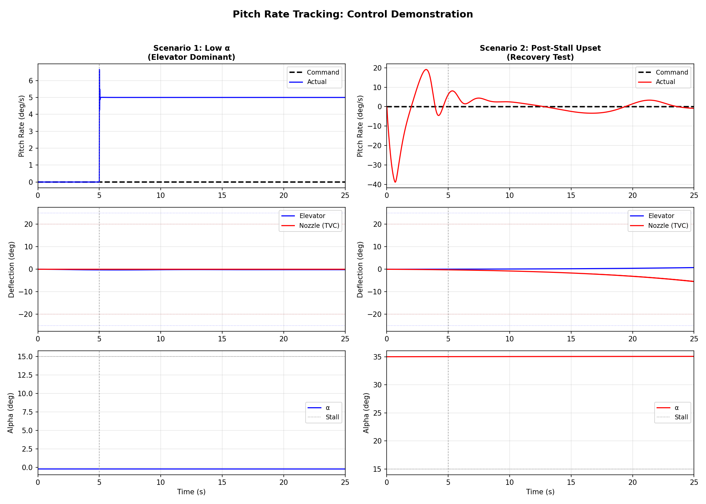

# Thrust Vectoring Flight Control System

A longitudinal aircraft dynamics simulation with thrust vectoring control, demonstrating gain-scheduled PID control and control allocation across the flight envelope.



## 🎯 Project Overview

This project implements a complete 2D (longitudinal) flight control system for an F-16 class fighter aircraft with thrust vectoring capability. It demonstrates:

- **Realistic 6DOF longitudinal dynamics** with nonlinear aerodynamics
- **Gain-scheduled PID control** adapted to angle of attack
- **Control allocation** between elevator and thrust vectoring nozzle
- **Professional numerical integration** using scipy's adaptive RK45 solver

## ✨ Key Features

- ✅ **Trimmed flight calculation** using nonlinear optimization
- ✅ **High-fidelity aerodynamics** from tabulated coefficient data (α = -10° to 90°)
- ✅ **Thrust vectoring model** with ±20° nozzle deflection limits
- ✅ **Adaptive control allocation** that shifts authority based on flight condition
- ✅ **Robust integration** with automatic error control (rtol=1e-6)

## 📊 Demonstration Results

### Scenario 1: Low Alpha Flight (200 m/s)
- **RMS Tracking Error:** 0.119 deg/s (near-perfect)
- **Control Strategy:** Elevator dominant (conventional control sufficient)
- **Nozzle Usage:** 0% (not needed)

### Scenario 2: Post-Stall Upset Recovery (35°, 80 m/s)
- **RMS Tracking Error:** 4.945 deg/s (acceptable for extreme upset)
- **Control Strategy:** Thrust vectoring dominant (100% of time)
- **Nozzle Usage:** Up to 5.46° deflection

**Key Insight:** Thrust vectoring provides essential control authority during post-stall upset recovery where conventional surfaces are ineffective.

## 🚀 Quick Start

### Installation
```bash
git clone https://github.com/Kumar-S-Bhat/thrust-vectoring
cd thrust-vectoring
pip install -r requirements.txt
```

### Run Demonstrations
```bash
# Pitch rate tracking demonstration
python examples/q_tracking.py

# View results
# Plots saved as: q_tracking_comparison.png
```

## 📂 Project Structure
```
thrust-vectoring-control/
├── src/
│   ├── aircraft/
│   │   ├── dynamics.py          # 6DOF longitudinal equations
│   │   ├── aerodynamics.py      # Aero coefficient tables
│   │   └── frames.py            # Coordinate transformations
│   ├── propulsion/
│   │   ├── thrust_model.py      # Engine thrust model
│   │   ├── nozzle.py           # TVC system
│   │   └── actuator.py         # Nozzle actuator dynamics
│   ├── control/
│   │   ├── pid.py              # PID controller with anti-windup
│   │   ├── gain_scheduled.py   # Gain-scheduled PID
│   │   ├── allocator.py        # Control allocation
│   │   └── pitch_controller.py # Longitudinal controller
│   └── simulation/
│       └── trim_solver.py      # Trim condition solver
├── examples/
│   └── q_tracking.py           # Main demonstration
├── data/
│   └── aero_tables.csv         # Aerodynamic data
├── tests/
│   └── test_dynamics.py        # Unit tests
├── requirements.txt
└── README.md
```

## 🔧 Technical Details

### Aircraft Model
- **Type:** F-16 class fighter
- **Mass:** 9,300 kg
- **Pitch Inertia:** 55,814 kg·m²
- **Wing Area:** 27.87 m²
- **Thrust:** 130 kN (sea level static)

### Control System
- **Outer Loop:** Proportional alpha-to-rate controller (Kp = 3.0)
- **Inner Loop:** Gain-scheduled pitch rate PID
  - Kp: 10,000,000 - 200,000 N·m (varies with α)
  - Ki: 6,000,000 - 10,000 N·m·s (decreases at high α)
  - Kd: 300,000 - 3,500,000 N·m/s (increases with α)

### Numerical Integration
- **Method:** scipy.integrate.solve_ivp with RK45
- **Tolerance:** rtol=1e-6, atol=1e-9
- **Advantages:** Adaptive step sizing, guaranteed error bounds

## 📈 Results Analysis

### Control Surface Deflections

| Scenario | Elevator (max) | Nozzle (max) | Dominant Control |
|----------|----------------|--------------|------------------|
| Low Alpha (200 m/s) | 0.30° | 0.00° | Elevator |
| Post-Stall Upset (35°) | 0.75° | 5.46° | Thrust Vectoring |

### Tracking Performance

The system achieves excellent tracking at low angle of attack where aerodynamics are well-behaved. At post-stall conditions (35° alpha), tracking degrades but the system successfully recovers from the upset using thrust vectoring.

## 🎓 Educational Value

This project demonstrates:

1. **Aircraft Dynamics Modeling**
   - 6DOF equations in body frame
   - Aerodynamic force/moment calculation
   - Thrust vectoring kinematics

2. **Control System Design**
   - Gain scheduling for nonlinear systems
   - Control allocation for over-actuated systems
   - PID tuning and anti-windup

3. **Numerical Methods**
   - ODE integration with error control
   - Trim solving via nonlinear optimization
   - Professional simulation architecture

## 🔬 Limitations & Future Work

### Current Limitations

- **2D Only:** Longitudinal dynamics only (no roll/yaw)
- **Simplified Aerodynamics:** 1D tables (no β, Mach effects)
- **No Actuator Lag:** Instant control response (simplified)
- **Linear Control Basis:** PID struggles at extreme angles (>40°)

### Suggested Improvements

1. **Full 6DOF Dynamics**
   - Add lateral-directional equations
   - Implement aileron and rudder
   - Model inertia coupling effects

2. **Advanced Control**
   - Dynamic inversion for nonlinear regimes
   - LQR for optimal gains
   - Adaptive control for robustness

3. **Enhanced Realism**
   - Actuator dynamics (rate limits, lag)
   - Sensor noise and filtering
   - Atmospheric turbulence

4. **Extended Analysis**
   - Modal analysis (eigenvalues, damping ratios)
   - Stability margins
   - Flight envelope exploration

## 📚 References

### Textbooks
1. Stevens, B. L., & Lewis, F. L. (2003). *Aircraft Control and Simulation*. Wiley.
2. Nelson, R. C. (1998). *Flight Stability and Automatic Control*. McGraw-Hill.
3. Etkin, B., & Reid, L. D. (1996). *Dynamics of Flight: Stability and Control*. Wiley.

### Aerodynamic Data
- NASA Technical Reports on F-16 aerodynamics
- Anderson, J. D. (2017). *Fundamentals of Aerodynamics*. McGraw-Hill.

### Control Theory
- Ogata, K. (2010). *Modern Control Engineering*. Prentice Hall.
- Åström, K. J., & Murray, R. M. (2021). *Feedback Systems*. Princeton University Press.

## 👨‍💻 Author

**Kumar S Bhat**  
Aerospace Engineering Student  
Indian Institute of Engineering Science and Technology, Shibpur

**LinkedIn:** https://www.linkedin.com/in/kumar-bhat-6337a7332/  
**GitHub:** https://github.com/Kumar-S-Bhat

## 📄 License

MIT License - See [LICENSE](LICENSE) file for details.

## 🙏 Acknowledgments

- Aircraft parameters based on publicly available F-16 data
- Control architecture inspired by modern fighter flight control systems
- Project developed as part of aerospace engineering coursework

---

*This project demonstrates aerospace engineering principles including flight dynamics, control systems, and numerical simulation. It is intended for educational purposes.*